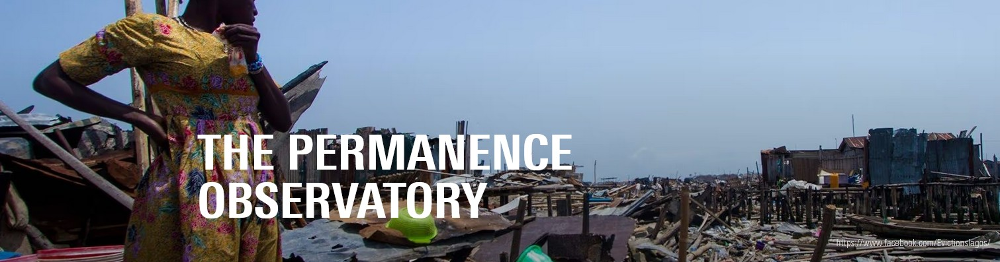
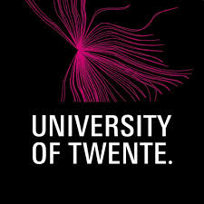

# The Permanence Observatory



<p align="center">
  
</p>

## About the Observatory

The **Permanence Observatory (PO)** is a global initiative that uses geospatial analysis and field documentation to protect informal settlement communities from unlawful evictions. By combining satellite imagery, remote sensing, and legal advocacy, PO provides irrefutable evidence of territorial occupation, helping communities secure their right to remain. 

Funded by human rights and technology grants, PO collaborates with global practitioners to present its findings in courts, advocacy forums, and international bodies.
Find out more: [www.permanenceobservatory.org/](https://www.permanenceobservatory.org/)

---

## Who We Are

We are global mappers investigating informal settlements. Our team includes experts in:
- Remote sensing technology
- Field documentation
- Urban planning
- Legal advocacy
- Human rights

We employ advanced tools including satellite imagery, geospatial data, and on-the-ground testimonies to create comprehensive documentation crucial in defending communities against forced evictions. We are an interdisciplinary organization working at the intersection of technology, law, and human rights.

---

## What We Do

We use **geospatial analysis** and **field surveys** to provide scientific proof of communities' land occupation. Our work helps prevent evictions by supporting legal recognition and protection. Through advocacy and evidence, we empower communities to claim their housing rights.

### The News Tracker

This repository hosts the **Slum News Tracker** - an automated, daily-updating interactive map that monitors global news coverage of informal settlements. The tracker:

- 🗺️ **Maps global news** about informal settlements in real-time
- 📊 **Categorizes events** (evictions, fires, violence, health crises, etc.)
- 🔍 **Provides interactive filtering** by event type and location
- 📈 **Visualizes trends** through bar charts and geographic clustering
- 🌐 **Aggregates data** from 200+ locations across Africa, Asia, and Latin America
- 🤖 **Updates automatically** every day using GDELT data

**Live Map:** [https://permanence-observatory.github.io](https://permanence-observatory.github.io)

---

## How We Choose Our Projects

We partner with communities at risk of eviction to provide legal and spatial documentation. Our focus is on cases where our methods can make a decisive impact. We aim to influence policies and legal decisions that secure housing rights.

---

## How We Are Funded

Our funding comes from:
- Human rights and technology grants
- Academic partnerships
- Project-specific support

All income is reinvested to advance our mission.

---

## Where Our Work Is Presented

We share our findings with:
- **Courts** - Legal cases defending community rights
- **Policymakers** - Influencing housing and urban policy
- **Advocacy groups** - Supporting grassroots movements
- **International bodies** - UN, European Court of Human Rights
- **Citizen tribunals** - Public forums amplifying marginalized voices

Our evidence is used in legal cases and public forums. We strive to amplify marginalized voices in decision-making spaces.

---

## Legal Admissibility

It is our intention that our documentation can be used as **legal evidence in courts worldwide**, including the UN and the European Court of Human Rights. Its scientific rigor strengthens community claims against forced displacement.

---

## Research Network

### Research Team
- **Jota Samper** - University of Colorado Boulder (Professor)
- **Julio Pedrassoli** - University of São Paulo & Western Michigan University (Professor)
- **M. Kuffer (Monika)** - University of Twente (Professor)
- **Malena Jaramillo Espinosa** - Associate Researcher (Permanence Observatory)
- **Juan Manuel D'Attoli** - Associate Researcher (Permanence Observatory)
- **Angela Abascal** - Public University of Navarra (Postdoctoral Researcher)
- **R. Vargas Maretto (Raian)** - University of Twente (Professor)
- **Andrew Maki** - Justice and Empowerment Initiatives - JEI (Co-director)
- **Anthony Boanada-Fuchs** - Institute for Housing and Urban Development Studies - IHS (Head of Projects and Partnerships)

### PhD Candidates
- **F. Campomanes MSc (Enzo)** - PhD Candidate at University of Twente
- **L. Trento Oliveira MSc (Lorraine)** - PhD Candidate at University of Twente

---

## Institutional Partners

<p align="center">
  
  
  
  
</p>

---

## Technical Information

### News Tracker Technology
- **Data Source:** GDELT Project (Global Database of Events, Language, and Tone)
- **Coverage:** 200+ informal settlement locations globally
- **Update Frequency:** Daily (automated via GitHub Actions)
- **Technology Stack:** Python, Leaflet.js, GitHub Pages
- **Multilingual Support:** Keywords in English, Spanish, Portuguese, French, Hindi, and more

### Contact
For technical details about the news tracker, contact:

**Julio Pedrassoli**  
📧 jpedrassoli@usp.br

---

## Repository Structure

```
permanence.github.io/
├── index.html              # Live news map (auto-generated daily)
├── gdelt_version_v21.py    # Main news tracker script
├── .github/
│   └── workflows/
│       └── update-map.yml  # Automation workflow
└── README.md               # This file
```

---

## License & Usage

This project is part of the Permanence Observatory's mission to support informal settlement communities. The code and data are provided for research, advocacy, and educational purposes.

For collaboration inquiries or to support our mission, please contact us through our institutional partners.

---

*Last updated: February 2026*
